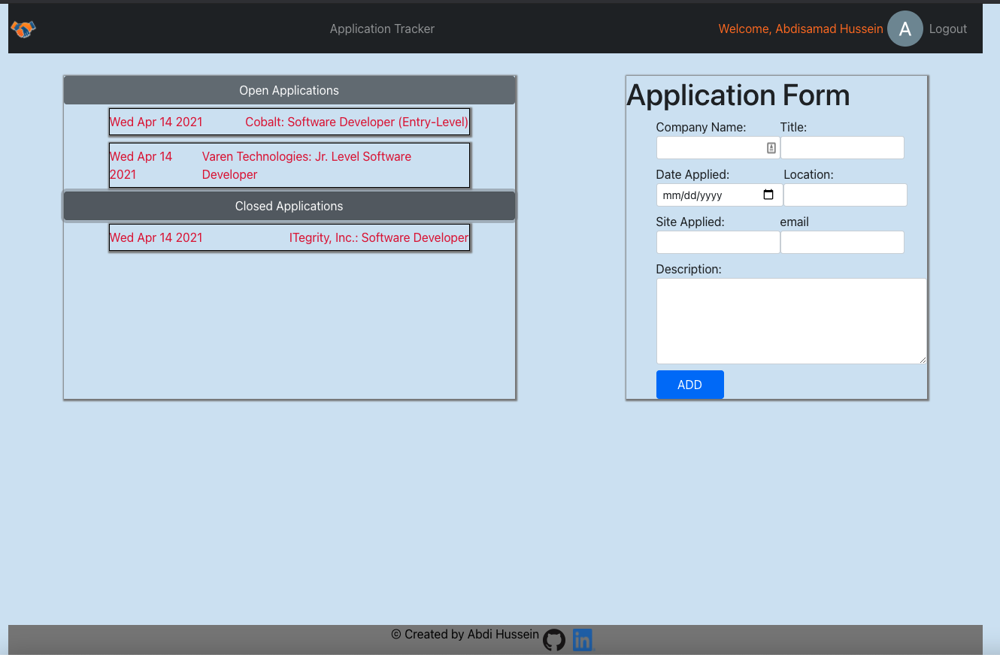
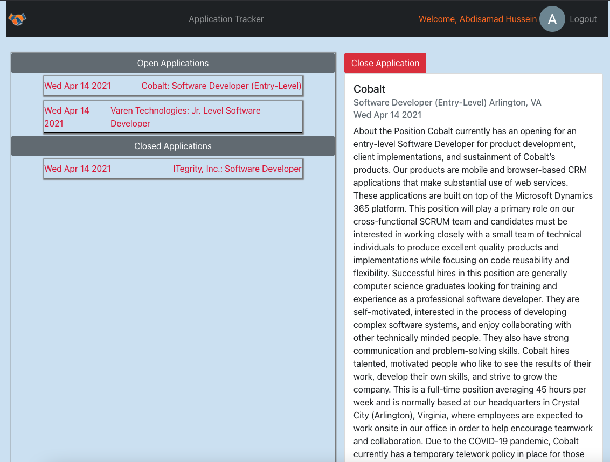
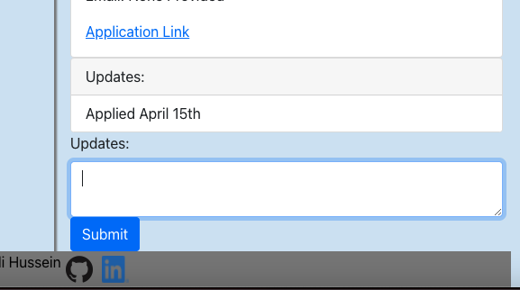

# Job Tracker

This app allows users to login with their Google account and track multiple job applications. Users can add updates to each application and check on previous details added. Users can also close an application.

[Trello Board](https://trello.com/b/Hg83TvC4/project-3-job-tracker)

## Screenshots

## Technologies

## Dependencies

- create-react-app
- bootstrap
- react-bootstrap
- react-router-dom
- firebase

## Getting Started

[Deployed Site](https://react-job-tracker.netlify.app/) |
[Backend Repo](https://github.com/abdi-hu/job-tracker-backend)

### Planned Future Enhancements

- Calendar integration
- Optimize data structure
- Delete Functionality
